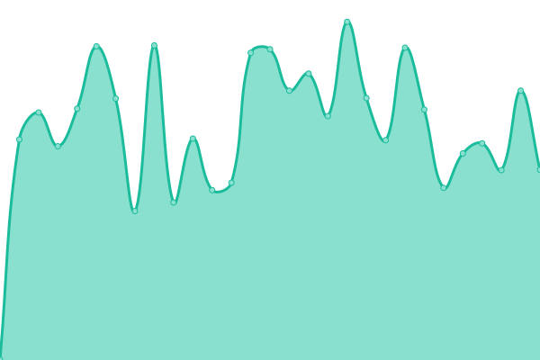
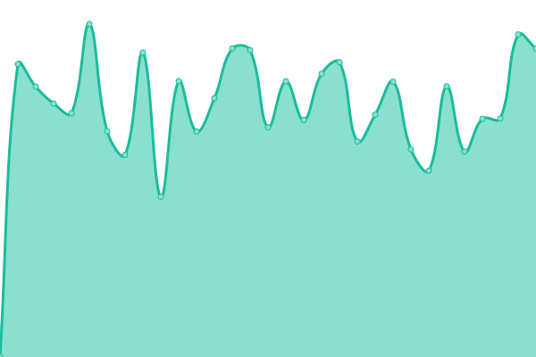
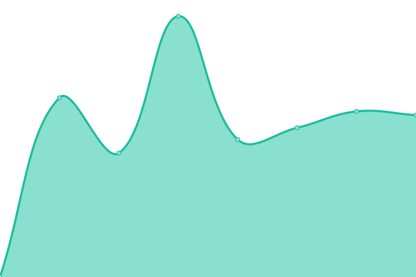
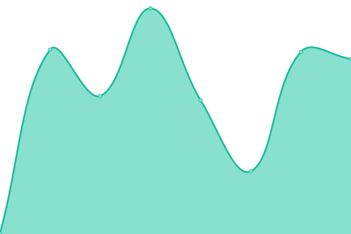

# [📈 Live Status](https://weequan93.github.io/midori): <!--live status--> **🟧 Partial outage**

This repository contains the open-source uptime monitor and status page for [weequan](https://weequan93.github.io/midori), powered by [Upptime](https://github.com/upptime/upptime).

With [Upptime](https://upptime.js.org), you can get your own unlimited and free uptime monitor and status page, powered entirely by a GitHub repository. We use [Issues](https://github.com/weequan93/midori/issues) as incident reports, [Actions](https://github.com/weequan93/midori/actions) as uptime monitors, and [Pages](https://weequan93.github.io/midori) for the status page.

<!--start: status pages-->
<!-- This summary is generated by Upptime (https://github.com/upptime/upptime) -->
<!-- Do not edit this manually, your changes will be overwritten -->
<!-- prettier-ignore -->
| URL | Status | History | Response Time | Uptime |
| --- | ------ | ------- | ------------- | ------ |
|  [Deriw Trade](https://www.deriw.com/trade/WBTC-USDT) | 🟩 Up | [deriw-trade.yml](https://github.com/weequan93/midori/commits/HEAD/history/deriw-trade.yml) | 

 934ms
     
 | 

<a href="https://weequan93.github.io/midori/history/deriw-trade">100.00%</a>
    

|  [Deriw RPC](https://rpc.test.deriw.com) | 🟩 Up | [deriw-rpc.yml](https://github.com/weequan93/midori/commits/HEAD/history/deriw-rpc.yml) | 

 994ms
     
 | 

<a href="https://weequan93.github.io/midori/history/deriw-rpc">100.00%</a>
    

|  [Deriw Explorer](https://explorer.test.deriw.com) | 🟩 Up | [deriw-explorer.yml](https://github.com/weequan93/midori/commits/HEAD/history/deriw-explorer.yml) | 

 1988ms
     
 | 

<a href="https://weequan93.github.io/midori/history/deriw-explorer">98.43%</a>
    

|  [Deriw Price](https://api.test.deriw.com/client/candles?symbol=WBTC&preferable_chain_id=97&period=5m&from=1729737900&limit=1&type=2) | 🟩 Up | [deriw-price.yml](https://github.com/weequan93/midori/commits/HEAD/history/deriw-price.yml) | 

 1229ms
     
 | 

<a href="https://weequan93.github.io/midori/history/deriw-price">100.00%</a>
    

|  [Marquee Prod](https://app.marquee.fi/api/client/insurance/market?coin_name=&sort_by=2) | 🟥 Down | [marquee-prod.yml](https://github.com/weequan93/midori/commits/HEAD/history/marquee-prod.yml) | 

 2330ms
     
 | 

<a href="https://weequan93.github.io/midori/history/marquee-prod">96.11%</a>
    

|  [Hacker News](https://news.ycombinator.com) | 🟩 Up | [hacker-news.yml](https://github.com/weequan93/midori/commits/HEAD/history/hacker-news.yml) | 

 393ms
     
 | 

<a href="https://weequan93.github.io/midori/history/hacker-news">100.00%</a>
    

<!--end: status pages-->

[**Visit our status website →**](https://weequan93.github.io/midori)

## 📄 License

- Powered by: [Upptime](https://github.com/upptime/upptime)
- Code: [MIT](./LICENSE) © [Anand Chowdhary](https://anandchowdhary.com), supported by [Pabio](https://pabio.com)
- Data in the `./history` directory: [Open Database License](https://opendatacommons.org/licenses/odbl/1-0/)
